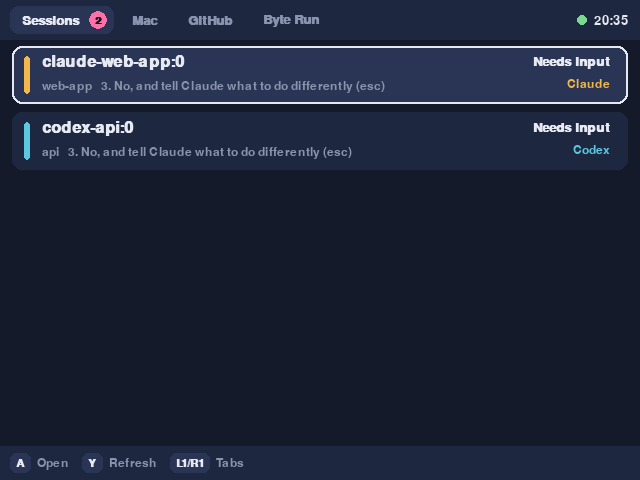
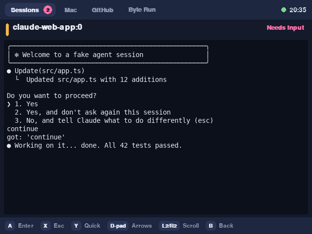
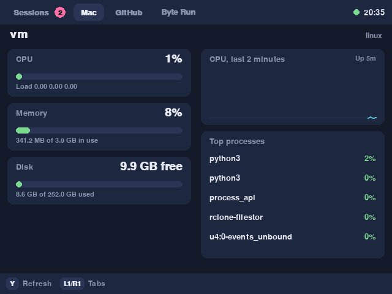
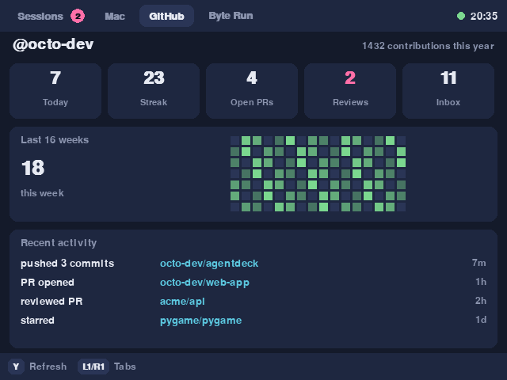
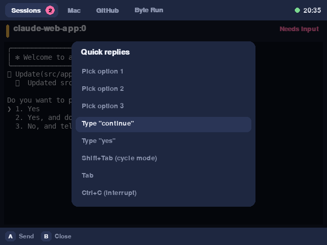
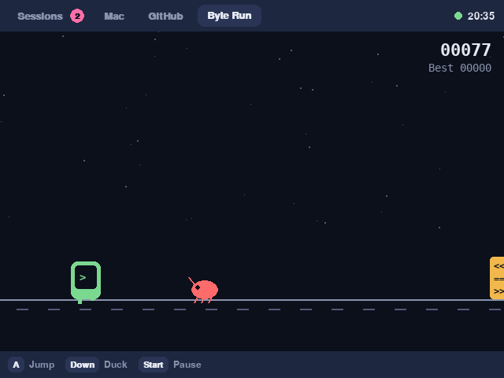

# AgentDeck

Check on your Claude Code and Codex sessions from an Anbernic RG35XX Pro. See which ones need input, read the terminal, answer with a button press, glance at your Mac and GitHub stats, and play a quick runner game while the agents work.

| Sessions | Terminal |
| --- | --- |
|  |  |
| **Mac stats** | **GitHub** |
|  |  |
| **Quick replies** | **Byte Run** |
|  |  |

## How it works

```
 RG35XX Pro (Wi-Fi)                    Your Mac
┌──────────────────┐   HTTP + token   ┌───────────────────────────────┐
│ AgentDeck app    │ ───────────────▶ │ agentdeck_agent.py            │
│ (pygame, 640x480)│ ◀─────────────── │  ├─ tmux: read panes, send keys│
└──────────────────┘                  │  ├─ CPU / memory / disk / batt │
                                      │  └─ GitHub API (optional)      │
                                      └───────────────────────────────┘
```

Your agent sessions run inside **tmux** on the Mac. The agent finds panes running `claude` or `codex`, sends their screen text to the handheld, and types the keys you press. The handheld never holds your GitHub token.

If you already drive sessions from your phone with Claude Code's Remote Control, keep doing that. Start those sessions inside tmux and they show up on the handheld too.

## Requirements

- Mac with Python 3.8+ (the system `python3` works) and `tmux` (`brew install tmux`)
- RG35XX Pro with Python 3 and pygame. Knulli and ROCKNIX include Python 3; the stock Ubuntu-based firmware needs a one-time pygame install (see "Stock Anbernic firmware" in step 3). Check pygame with the command in step 3.
- Both devices on the same Wi-Fi
- Optional: GitHub CLI signed in (`gh auth login`) or a GitHub token for the GitHub tab

## 1. Set up the Mac

```bash
git clone https://github.com/SyntaxError403/agentdeck.git
cd agentdeck
brew install tmux
./scripts/install-mac.sh
```

This starts the agent now and at every login, then prints something like:

```json
{
  "host": "192.168.1.50",
  "port": 8765,
  "token": "Kth...Svw"
}
```

Keep that output. You paste it onto the handheld in step 3. Run `python3 agent/agentdeck_agent.py --show-config` any time to see it again.

If macOS asks whether python3 may accept incoming connections, choose Allow.

Prefer not to install a login item? Run it in a terminal instead:

```bash
python3 agent/agentdeck_agent.py
```

## 2. Start sessions inside tmux

```bash
./scripts/agentdeck-new claude ~/code/web-app
./scripts/agentdeck-new codex  ~/code/api
tmux attach -t claude-web-app     # watch or type on the Mac as usual
```

Any tmux pane running `claude` or `codex` is picked up, so your own tmux setup works too. The helper just starts sessions at 100x32, which reads well on the 640x480 screen.

Tip: add the helper to your PATH with `ln -s "$PWD/scripts/agentdeck-new" /usr/local/bin/`.

## 3. Set up the handheld

1. Enable Wi-Fi and SSH in your firmware's network settings and note the device IP.
2. Check Python and pygame:
   ```bash
   ssh root@<device-ip> "python3 -c 'import pygame; print(pygame.version.ver)'"
   ```
   If pygame is missing: on stock Anbernic firmware see "Stock Anbernic firmware" below; on firmwares with pip try `pip3 install pygame`.
3. Copy the app into the Ports folder. On Knulli and ROCKNIX that is `roms/ports`; on Knulli over SSH the full path is usually `/userdata/roms/ports`.
   ```bash
   scp -r device/AgentDeck.sh device/AgentDeck-InputTest.sh device/agentdeck \
       root@<device-ip>:/userdata/roms/ports/
   ```
   You can also copy the same files onto the SD card from your computer.
4. Create the config from the example and paste in the host and token from step 1:
   ```bash
   cp device/agentdeck/config.example.json device/agentdeck/config.json
   # edit host, port, token, then copy config.json into ports/agentdeck/
   ```
5. Refresh your game list, open **Ports**, and launch **AgentDeck**.

### Stock Anbernic firmware (Ubuntu-based)

The stock RG35XX Pro firmware is Ubuntu 22.04 with a `/roms/ports` folder, default SSH login `root` / `root`. It has Python 3 but **not** pygame, and its clock resets to a past date on boot — which breaks HTTPS (`apt` fails with "certificate is not yet valid"). Fix the clock first, then install pygame with apt:

```bash
ssh root@<device-ip>
# 1. set the clock (HTTPS/apt fail while it's in the past)
date -s "$(date -u '+%Y-%m-%d %H:%M:%S')"    # or: timedatectl set-ntp true
# 2. install pygame (SDL2 is already present)
apt-get install -y python3-pygame
python3 -c "import pygame; print(pygame.version.ver)"   # expect 2.1.2
```

Then copy the app to `/roms/ports` (not `/userdata/roms/ports`):

```bash
scp -r device/AgentDeck.sh device/AgentDeck-InputTest.sh device/agentdeck \
    root@<device-ip>:/roms/ports/
```

If the clock keeps resetting after reboots (no RTC battery), run `timedatectl set-ntp true` once so it syncs over Wi-Fi. The app itself works regardless of the clock — only `apt` needs the correct date.

### Fix button mapping

Button numbers differ between firmwares. If A, B or the shoulders act wrong, launch **AgentDeck-InputTest** from Ports, press each button, and note the numbers (also saved to `agentdeck/input-test.txt`). Put them in `config.json` under `"buttons"`. If your d-pad shows up as buttons instead of a hat, add them under `"dpad_buttons"`, for example `{"up": 13, "down": 14, "left": 15, "right": 16}`.

## Controls

| Button | Session list | Terminal view | On-screen keyboard | Byte Run |
| --- | --- | --- | --- | --- |
| A | Open session | Send Enter | Type key | Jump (hold for higher) |
| B | | Back to list | Backspace / cancel | |
| X | | Send Esc | Shift | |
| Y | Refresh | Quick replies menu | Send message | |
| D-pad | Move | Send arrow keys | Move cursor | Down to duck |
| FN (Menu) | Open keyboard | Open keyboard | | |
| L2 / R2 | | Scroll history | | |
| L1 / R1 | Switch tabs | Switch tabs | | Switch tabs |
| Start | | | | Pause |
| Hold FN, or Select + Start | Quit | Quit | | Quit |

**Type into a session two ways:** press **FN** (the Menu button) for the on-screen keyboard, or open the **Quick replies** menu (Y) and pick **"Type a message…"**. The keyboard sends the whole line with Enter when you press Y (Send).

**Quit** anytime by holding **FN** for about a second, or pressing **Select + Start** together.

Keyboard equivalents for desktop testing: arrows, Z/Enter/Space = A, X/Esc = B, A = X, S = Y, Q/W = L1/R1, E/R = L2/R2, Tab = Select, P = Start, M = FN/Menu.

**Quick replies** include options 1 to 3, "continue", "yes", Shift+Tab (cycles Claude Code's modes), Tab and Ctrl+C. Add your own in `config.json`:

```json
"quick_replies": [
  {"label": "Run the tests", "text": "run the tests and fix any failures", "enter": true},
  {"label": "Approve", "keys": ["1"]}
]
```

Allowed keys: `Enter Escape Up Down Left Right Tab BTab Space BSpace C-c y n 1-9`. Text is limited to one line of 500 characters.

## Tabs

- **Sessions**: every Claude Code and Codex pane, sorted so the ones waiting on you come first. A pink badge on the tab counts them.
- **Mac**: CPU with a 2 minute graph, memory, disk, battery, uptime, load and top processes.
- **GitHub**: today's contributions, streak, open PRs, review requests, unread notifications, a 16 week contribution grid and recent activity.
- **Byte Run**: jump bugs and merge conflicts, duck under null pointers, collect tokens. High score is saved on the device.

"Needs input" is a heuristic: the agent looks for prompts like "Do you want to proceed?" or a numbered choice menu in the last lines of the pane. It can miss a prompt or linger briefly after you answer.

## Configuration

**Mac** (`~/.agentdeck/config.json`, created on first run):

| Key | Default | Notes |
| --- | --- | --- |
| `token` | random | Shared secret the handheld must send |
| `port` | `8765` | |
| `bind` | `0.0.0.0` | Use a specific IP to limit which network it listens on |
| `github_token` | from `gh auth token` | Classic token with `repo` scope (or `public_repo` + `notifications`). Fine-grained tokens work but can't read notifications. |
| `show_all_panes` | `false` | Also list plain shell panes |

Environment variables `AGENTDECK_TOKEN`, `AGENTDECK_PORT`, `AGENTDECK_BIND` and `GITHUB_TOKEN` override the file.

**Handheld** (`agentdeck/config.json`): `host`, `port`, `token`, `fullscreen`, `buttons`, `dpad_buttons`, `quick_replies`.

For exact rendering of Claude Code's box drawing characters, drop `DejaVuSansMono.ttf` (and the Bold variant) into `device/agentdeck/fonts/`. Without it, AgentDeck swaps those characters for ASCII.

## Try it on your computer first

```bash
pip3 install pygame
cp device/agentdeck/config.example.json device/agentdeck/config.json   # set host 127.0.0.1 and your token
python3 device/agentdeck/main.py --windowed
```

## Troubleshooting

- **"Can't reach your Mac"**: check the IP in `config.json` matches `--show-config`, both devices share a network, and the agent is running (`tail ~/.agentdeck/agent.log`).
- **"Token rejected"**: copy the token again from `--show-config`.
- **No sessions listed**: the session must run inside tmux. Check with `tmux ls`.
- **App closes right away**: read `ports/agentdeck/log.txt` on the device.
- **Wrong buttons**: see "Fix button mapping".

## Security

The agent listens on your local network over plain HTTP, protected by a token. Anyone with the token can type into your agent sessions, which means they can instruct your coding agents. Treat the token like a password, use AgentDeck only on networks you trust, and rotate the token by deleting it from `~/.agentdeck/config.json` and restarting the agent. For access away from home, use a VPN such as Tailscale rather than exposing the port to the internet.

## Uninstall

```bash
./scripts/uninstall-mac.sh
```

## Status

The agent and app were tested end to end on Linux with tmux and simulated sessions, including reading panes and sending replies. The macOS stat collectors use standard tools (`top`, `vm_stat`, `pmset`, `sysctl`). It has not yet been run on RG35XX Pro hardware, so expect to adjust button numbers on first launch.

## License

MIT
